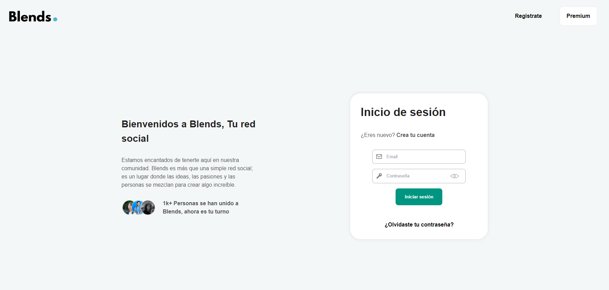
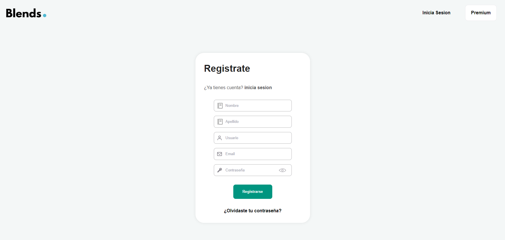
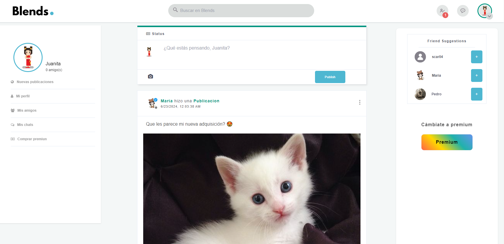
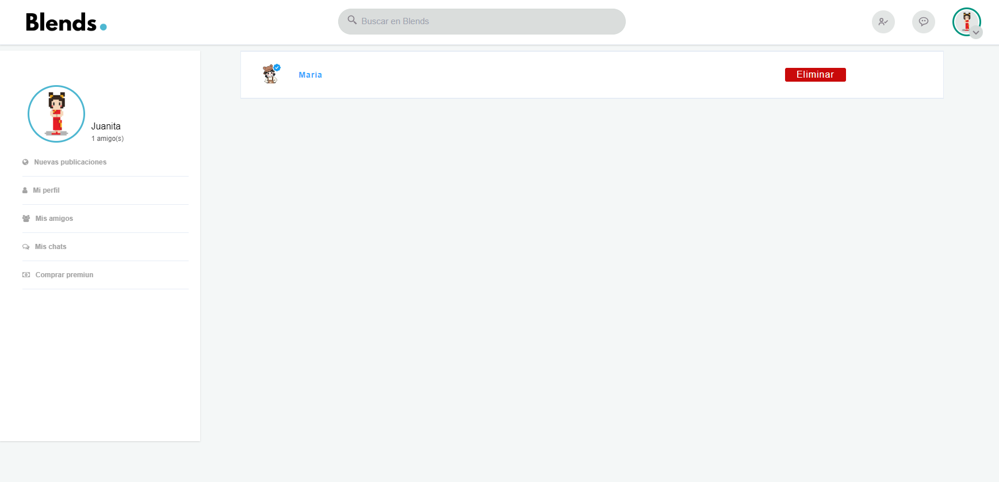
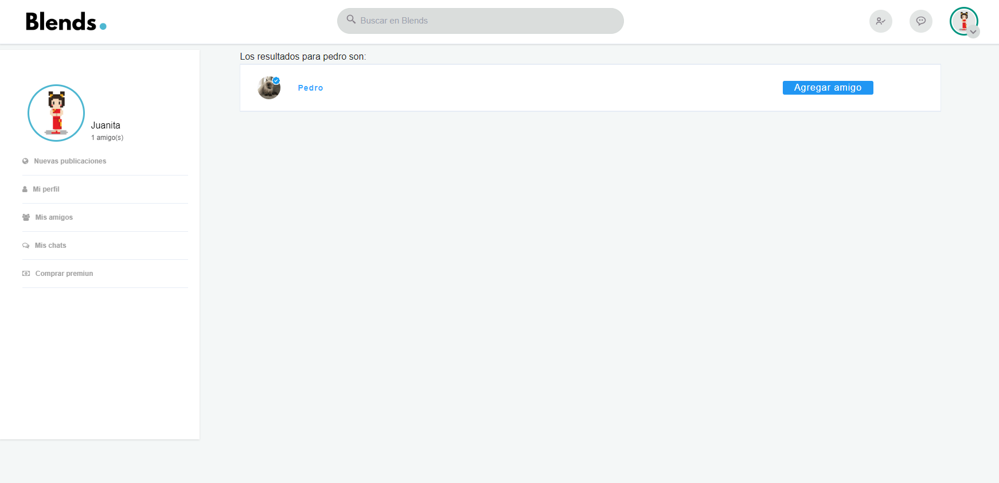
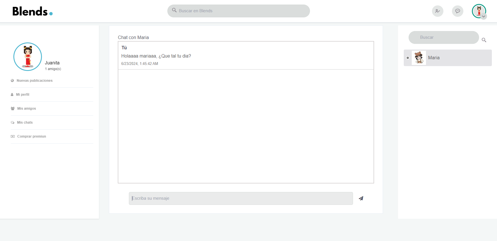
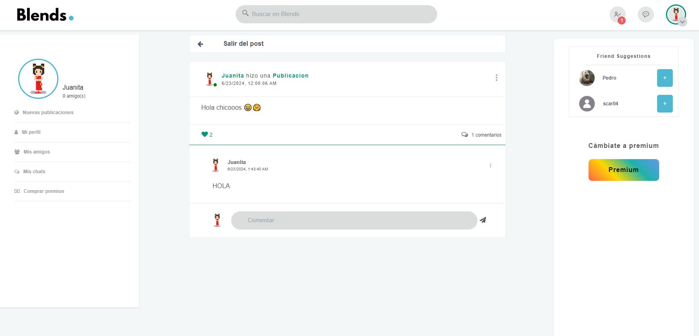
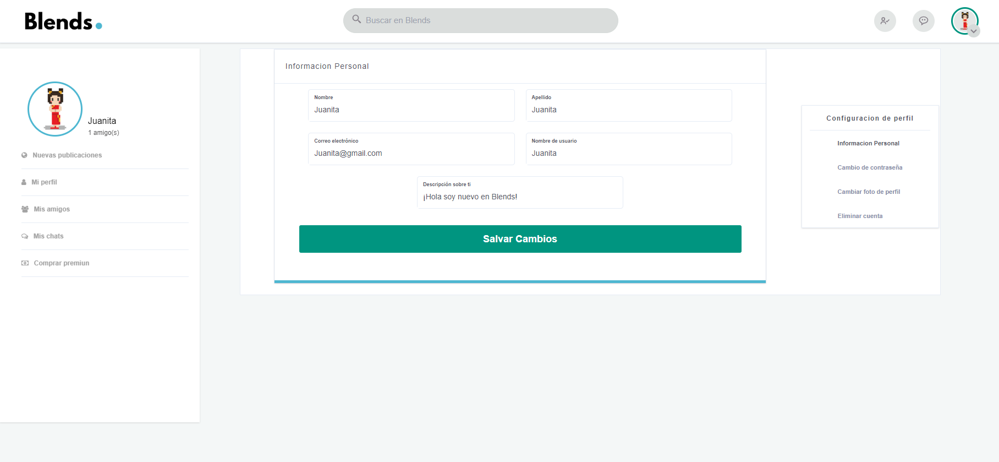
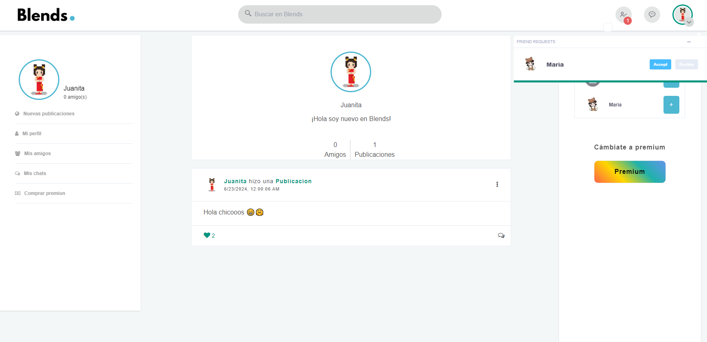
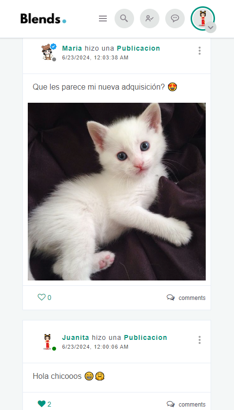

# ✨ BLENDS RED SOCIAL INTERACTIVA ✨
## Proyecto final de Scarlet Herrera y José Perdomo del Bootcamp Lexpin
Blends es una red social desarrollada con Stack MERN, concebida como nuestro proyecto final en el Bootcamp Lexpin. Este proyecto nos permitió aplicar y consolidar los conocimientos adquiridos a lo largo del curso. Desde el inicio, nos sentimos entusiasmados por la oportunidad de desarrollar una aplicación web de esta magnitud. Durante el proceso, enfrentamos desafíos significativos que nos han permitido crecer como aprendices, destacando por nuestras habilidades para idear, diseñar, desarrollar y planificar una aplicación que funcione según nuestras expectativas.

## 💻 Tecnologías: Stack Mern
Para desarrollar Blends utilizamos: 
- React (front).
- Express (Backend): Creación de API.
- Mongodb (Base de datos).

## ⚙ Funcionalidades:

Para llevar a cabo el desarrollo de Blends, usamos la metodología Scrum, la cual nos permitió gestionar de manera ordenada el desarrollo de cada funcionalidad del software.

- **Registro y Login:** Permite a los usuarios registrarse, iniciar sesión y guarda toda su información en la base de datos. El token se mantiene en el LocalStorage para mantener la sesión iniciada durante un tiempo determinado.
- **Publicaciones:**  Los usuarios pueden realizar dos tipos de publicaciones: solo texto y con imagen. También tienen la capacidad de eliminar sus propias publicaciones.
- **Likes:** Los usuarios pueden dar like a cualquier publicación y retirar su like si así lo desean.
- **Comentarios:** Posibilidad para los usuarios de comentar en las publicaciones y eliminar sus propios comentarios.
- **Publicaciones Individuales** Permite ver publicaciones individualmente, incluyendo los comentarios asociados a cada una.
- **Buscar Usuario:** Mediante el buscador, los usuarios pueden buscar a otros usuarios de Blends por su nombre.
- **Perfil de Usuario:** Los usuarios pueden ver su propio perfil y el de otros usuarios.
- **Amistades:** Funcionalidades para visualizar, agregar y eliminar amigos.
- **Chat:** los usuarios tienen la capacidad de chatear entre ellos solo si son amigos.
- **Usuario Premium:** Los usuarios tienen la opción de comprar una membresía Premium, que les otorga un distintivo verificado en su perfil y publicaciones.
- **Estado Online y offline:** Indicadores de estado para mostrar si un usuario está en línea u offline.
- **Sugerencia de Amigos:** El sistema de sugerencia de amigos recomienda usuarios random de la aplicacion.
- **Editar Información:** Los usuarios pueden editar su información personal como nombre, correo, contraseña, descripción, imagen de perfil y también tienen la opción de eliminar su cuenta.
- **Administración:** Hay dos tipos de usuarios: el usuario estándar y el administrador. El administrador tiene privilegios para eliminar publicaciones, editar la información de los usuarios y eliminar cuentas si es necesario.
- **Notificaciones:** Los usuarios reciben notificaciones cuando reciben solicitudes de amistad.
- **Ecommerce:** La aplicacion tiene un perqueño ecommerce para que los usuarios puedan acceder al plan premium que la aplicación ofrece.
- **Facturación:** Luego de que el usuario complete su compra del plan premium se enviara a un correo la factura por la compra de su servicio.
- **Recuperacion de contraseña:** Se puede recuperar la contraseña mediante un correo electrónico. esta opción se puede ver en el login.

## 🖼 Interfaz:
En esta seccion se muestra solo algunas pantallas de la aplicación, se puede visualizar su estilo y diseño, También la forma en la que adapta para moviles.
### Login:

### Register:

### Feed: 

### Lista de amigos:

### Buscador de usuarios:

### Chat:

### Publicaciones indiviales y comentarios:

### Editar usuario:

### Perfil de usuario:

### Movil (Responsive):

